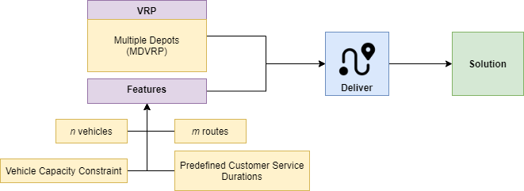

=========================
Deliver
=========================
Genetic algorithm and brute force method implementations for Multi Depot Vehicle Routing Problem.

Details
------
There are n vehicles roaming around the city and m orders waiting for the delivery.
Vehicles have a limited :

- amount of stock
- and predefined service durations.

This project has been developed with an inspiration from the method written by Ombuki-Berman et al.

        Ombuki-Berman, Beatrice, and Franklin T. Hanshar. "Using genetic algorithms for multi-depot vehicle routing." Bio-inspired algorithms for the vehicle routing problem. Springer, Berlin, Heidelberg, 2009. 77-99.
Usage
-----
Create a new enviroment and install required packages:
::
        pip install -r requirements.txt
Run script with this command:
::
        python -m deliver.main -i ./data/input.json --intermediate_prints -o ./data/output.json

To use `Cordeau’s Instances <https://github.com/fboliveira/MDVRP-Instances/blob/master/DESCRIPTION.md>`_ please use related input data and set ``--benchmark_input`` option.
::
        python -m deliver.main -i ./data/p01 --intermediate_prints --benchmark_input -o ./data/output.json

To use brute force method add ``--brute_force`` to the command:
::
        python -m deliver.main -i ./data/input.json --intermediate_prints --brute_force -o ./data/output.json

Output
-------
"Deliver" produces a json file shown in ``data\output.json``.

Example outputs can be found in data folder.
    - ``data/output_brute_force_with_no_constraint.json`` for brute-force approach. In this example that is assumed:
            - There is no predefined service durations
            - Vehicles have infinite capacity
    - ``data/output_brute_force_with_predefined_service_duration.json``
            - Included predefined service durations
            - Vehicles have infinite capacity. There is no capacity constraint
    - ``data/output_brute_force_with_capacity_constraint_and_predefined_service_duration.json``
            - Included capacity constraint
            - Included predefined service durations
    - ``data/output_genetic_algoritm_with_capacity_constraint_and_predefined_service_duration.json`` for genetic algorithm approach.
            - Included capacity constraint
            - Included predefined service durations
Installation for Development
------------
#. Install the project's development and runtime requirements::

        pip install -r requirements-dev.txt

#. Run the tests::

        paver test_all

Authors
=======

* Halil İbrahim Bestil
